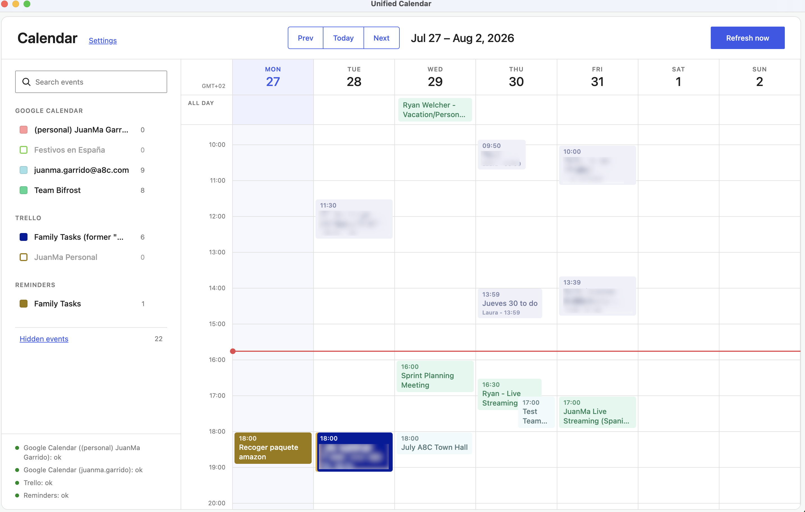

# Unified Calendar

A personal Electron app that merges Google Calendar, Trello cards with due
dates, Apple Reminders, Linear issues, Wallos subscription payments, and a
personal time tracker into one calendar. Its interface uses the WordPress
design system and `@wordpress/components`.



## Using the calendar

- Switch between **Day**, **Week**, **Month**, **Year**, and **Agenda** views.
  Day and Week show an hourly time grid with a separate all-day row; Month and
  Year show grid overviews; Agenda is a rolling 30-day forward-looking list
  starting today. The week starts on Monday and the current day is
  highlighted in every view.
- Events with a time appear in the scrollable 24-hour grid (Day/Week). All-day
  and multi-day events appear in the row above it, drawn as a single bar
  across the days they cover.
- Use the checkboxes in the sidebar to show or hide individual Google
  calendars, Trello boards, Reminders lists, Linear teams, and Wallos payment
  methods. On first launch, only the primary Google calendar and Reminders
  lists are enabled; secondary Google calendars, Trello boards, Linear teams,
  and Wallos are disabled until selected.
- Use each calendar's color control in the sidebar to customize its event
  color.
- Drag an event to move it to a new time or day. Google Calendar events can
  also be resized to change their duration. Trello cards and Reminders can be
  moved but not resized (they're points in time, not intervals). Linear
  issues, Wallos payments, and time-tracked sessions are read-only on the
  grid.
- Open an event's menu to visit its original Google Calendar event or Trello
  card, or open a Wallos payment in the Wallos dashboard. Apple Reminders and
  Linear issues don't provide a link-out.
- The event menu can hide one occurrence or an entire recurring series. Hidden
  events can be restored from **Settings → Hidden events**.
- Calendar visibility, colors, and hidden events are saved locally.
- Open **Settings** from the gear button beside the Calendar heading. Use
  **Connections** for accounts, permissions, and the time tracker's data
  folder, **Calendars** to choose which calendars/boards/teams are visible,
  **Hidden events** to restore exclusions, and **Time zones** to change how
  times are displayed.

### Menu bar agenda

The app adds a macOS menu bar item showing a visible title (not just an
icon) with the time until your next event, or the running time-tracked
session when one is active. Click it for today's agenda plus quick actions
to start/stop time tracking, add a note to the running session, open the
calendar, open Settings, or quit. Desktop notifications fire before each
upcoming event starts (events more than 24 hours out aren't scheduled yet;
they're picked up as they enter that window).

### Time tracking

A personal time tracker lets you start and stop work sessions and attach
notes to them, either from the menu bar or from the tracked-session bar/popover
in the app. Sessions and notes are stored in a local SQLite database (default
`~/.timetracker`, changeable from **Settings → Connections**) and notes are
also mirrored to per-project markdown files.

## Setup

```bash
npm install
```

## Launching with Apple Reminders access

Apple Reminders access requires the packaged, locally signed macOS app. The
generic Electron app used by `npm run dev` does not have a stable macOS privacy
identity, so Reminders may report `permission denied` in development mode.

Build and launch the packaged app from the project directory:

```bash
npm run package:mac
open -n "release/mac-arm64/Unified Calendar.app"
```

On first launch, macOS asks whether **Unified Calendar** may access Reminders.
Click **Allow**. You can review or change this later under **System Settings →
Privacy & Security → Reminders**.

After changing application code or `.env` credentials, run
`npm run package:mac` again and reopen the newly built app. Close older Unified
Calendar windows to avoid confusing a previous build with the current one.

## Connecting each source

All sources are optional — leave a source's credentials unset in `.env` and it
simply won't appear.

### Apple Reminders

Reads directly from your local Reminders app via EventKit. Follow **Launching
with Apple Reminders access** above; launching through `npm run dev` is not
sufficient for reliable Reminders permission handling.

### Google Calendar

1. In the [Google Cloud Console](https://console.cloud.google.com/apis/credentials), create an OAuth client of type **Desktop app**, and make sure the **Google Calendar API** is enabled for that project.
2. Copy `.env.example` to `.env` and fill in:
   ```
   GOOGLE_CLIENT_ID=...
   GOOGLE_CLIENT_SECRET=...
   ```
3. Build and open the packaged app, open **Settings → Connections**, and select
   **Connect another account**. Complete the consent flow in your browser.
4. Repeat the previous step for every Google account. Each account receives its
   own stored OAuth tokens and all of its calendars are listed separately.
5. Open **Settings → Calendars** (or use the sidebar) to enable the individual
   calendars you want to display. Only the primary calendar of a newly connected
   account is enabled by default.

`GOOGLE_ACCOUNTS` remains supported for installations created before in-app
account management. New installations do not need to add labels there.

Dragging or resizing a Google event requires the account to have granted
calendar write access. Accounts connected before this app requested that
scope stay read-only on the grid until reconnected from **Settings →
Connections**.

Tokens are stored locally via `electron-store` (in the Electron app's user data directory) — nothing is sent anywhere except Google's API.

### Trello

1. Get an API key at https://trello.com/power-ups/admin.
2. Generate a token by visiting (replace `YOUR_KEY`):
   ```
   https://trello.com/1/authorize?expiration=never&scope=read,write&response_type=token&key=YOUR_KEY
   ```
   `write` is what lets you drag a card to a new due date in the calendar. A
   token generated with `scope=read` still shows cards, but moving one fails with
   "Trello rejected the edit"; regenerate the token to fix it.
3. Add both to `.env`:
   ```
   TRELLO_API_KEY=...
   TRELLO_TOKEN=...
   ```
4. Leave `TRELLO_BOARD_IDS` blank to make every open board visible to the app.
   A single Trello token authorizes all boards that account can access; separate
   tokens are not required for each board. To prevent some boards from being
   fetched at all, set `TRELLO_BOARD_IDS` to a comma-separated list of IDs.
5. Rebuild with `npm run package:mac`, reopen the app, and click **Refresh now**.
6. Open **Settings → Calendars** and enable as many Trello boards as you want.
   Boards appear there even when they have no cards due during the displayed week.

### Linear

1. Create an API key from Linear → **Settings → Security & access → API keys**.
2. Add it to `.env`:
   ```
   LINEAR_API_KEY=...
   ```
3. Optionally set `LINEAR_TEAM_KEYS` to a comma-separated list of team keys to
   limit which teams' issues are fetched. Leave it blank to include every team
   the key can see.
4. Rebuild, reopen the app, and open **Settings → Calendars** to enable the
   teams you want. Each team appears as its own calendar, off by default. The
   calendar shows your assigned, open issues with a due date, as all-day
   events.

### Wallos

1. In your self-hosted [Wallos](https://wallosapp.com/) instance, get an API
   key from **Settings → API Key**.
2. Add both to `.env`:
   ```
   WALLOS_BASE_URL=...
   WALLOS_API_KEY=...
   ```
3. Rebuild, reopen the app, and open **Settings → Calendars** to enable the
   payment methods you want visible. Upcoming subscription payments appear as
   all-day events, one calendar per payment method. Opening a payment event
   takes you to your Wallos dashboard (Wallos has no per-subscription deep
   link, so it doesn't open the vendor's site directly).

### Time Tracker

No external account is required. The tracker reads and writes a local SQLite
database, defaulting to `~/.timetracker`. To point it at a different folder,
use **Settings → Connections → Change folder**, or set `TIMETRACKER_DIR` in
`.env` before first launch. See **Time tracking** above for how to use it.

## Running

```bash
npm run package:mac  # build the helper and packaged app required for Reminders
npm run dev          # development UI with hot reload; Reminders may be denied
npm run start        # preview build; Reminders may be denied
npm run build        # compile Electron assets without packaging
```

## Status bar

Each connected source shows `ok` or an error hint (not connected, permission
denied, helper not built, etc.) in the bar above the calendar grid. A failing
source never hides data from the others — it just stops updating until
reconnected.
